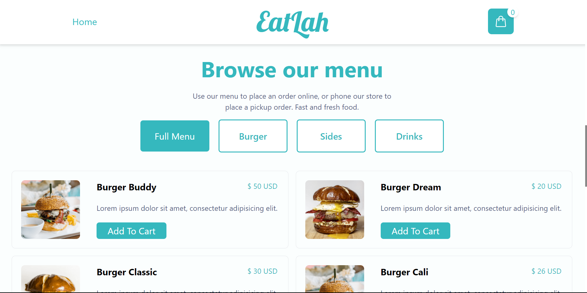
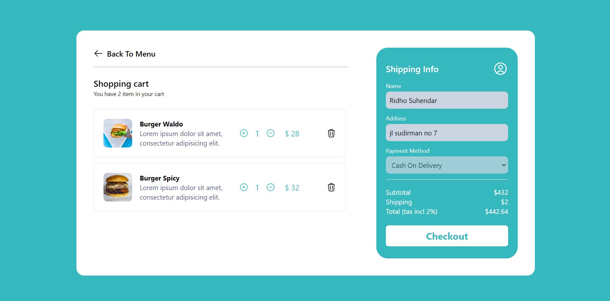

<h1 align="center">
  EatLah
</h1>

## Description

EatLah is webapp that allows customers to order food from restaurants, cafes, and other food establishments and have it delivered directly to their doorstep

## Built With

- [Vue.js]
- [Tailwindcss]
- [axios]


## Demo
<div align="center">
  
</div>

<div align="center">
  
</div>

## 🛠 Installation & Set Up

1. Clone the repo
   ```sh
   git clone https://github.com/rdhss/EatLah-vue.git
   ```
1. change dir
   ```sh
   cd EatLah-vue
   ```
2. Install NPM packages
   ```sh
   npm install
   ```
3. Start the Application
   ```sh
   npm run serve
   ```